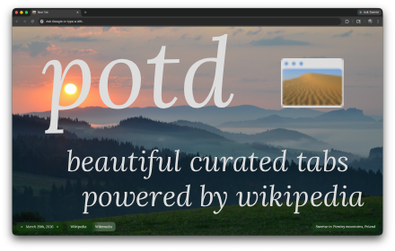

# Wikipedia Picture of the Day

[](#)

A Chrome extension that replaces your new tab page with the Wikipedia Picture of the Day — a full-viewport display of the image or video chosen daily by Wikipedia's editors, with context, navigation, and a link to the full article.


---

## Features

- **Full-viewport display** — photo or video fills the entire new tab
- **Daily updates** — content changes automatically each day via the Wikimedia Commons Atom feed
- **Historical navigation** — browse past Pictures of the Day with on-screen arrows or keyboard left/right keys
- **Info overlay** — title and description presented in a "liquid glass" overlay; hover to expand truncated descriptions
- **Wikipedia integration** — click the title to open the corresponding Wikipedia article
- **Panning animation** — large images pan slowly for an immersive feel
- **Video support** — animated and video POTDs are displayed natively

---

## Installation

### From the Chrome Web Store
*(Coming soon)*


### Load Locally (Developer Mode)

1. Clone the repository:
   ```bash
   git clone https://github.com/jdvne/potd.git
   cd potd
   ```
2. Open `chrome://extensions` in Chrome
3. Enable **Developer mode** (top-right toggle)
4. Click **Load unpacked** and select the repo folder
5. Open a new tab — you should see today's Picture of the Day

---

## Building and Distributing

Releases are built automatically via GitHub Actions. Pushing a version tag triggers the build and publishes the zip as a GitHub Release:

```bash
git tag v1.1
git push origin v1.1
```

To build locally:
```bash
./build.sh
```

This produces `build/potd-v{version}.zip` containing only distribution files. The version is read from `manifest.json`. The `build/` folder is gitignored.

For full Chrome Web Store submission instructions, see [PUBLISHING.md](PUBLISHING.md).

---

## Project Structure

```
potd/
├── manifest.json         # Chrome extension manifest (MV3)
├── new_tab.html          # New tab page markup
├── new_tab.css           # Styles
├── main.js               # Entry point — initialises the app
├── api.js                # Wikipedia and Wikimedia Commons API calls
├── state.js              # Global state and setters
├── date-utils.js         # Date formatting, navigation, and display
├── media-display.js      # Fetching, processing, and rendering media
├── event-handlers.js     # User interaction event listeners
├── dom-elements.js       # Cached DOM element references
├── icons/                # Extension icons (16, 32, 48, 64, 128px)
├── store/                # Chrome Web Store assets and listing copy
│   ├── listing.md        # Store name, description, keywords
│   ├── screenshots/      # Store screenshots
│   └── promotional/      # Promotional tile images
├── build.sh              # Build script
├── PUBLISHING.md         # Chrome Web Store submission guide
└── LICENSE               # GPL-3.0
```

---

## Architecture

The JavaScript is split into modules with distinct responsibilities rather than a single monolithic file:

| Module | Responsibility |
|---|---|
| `main.js` | App entry point; coordinates initialisation |
| `api.js` | All external API and feed requests |
| `state.js` | Shared mutable state and setters |
| `date-utils.js` | Date formatting, navigation, and DOM date updates |
| `media-display.js` | Fetch, process, and render images and videos |
| `event-handlers.js` | Keyboard, click, hover, and resize event listeners |
| `dom-elements.js` | Cached references to frequently accessed DOM nodes |

On load, `main.js` fetches the Wikimedia Commons POTD Atom feed, parses it, and hands the result to `media-display.js` to render today's entry. Navigation updates the displayed date in state and re-fetches the appropriate entry from the feed.

---

## Contributing

Contributions are welcome. To get started:

1. Fork the repo and create a branch for your change
2. Load the extension locally (see Installation above) to test your changes live
3. Keep changes focused — one concern per PR
4. Open a pull request with a clear description of what and why

There are no external dependencies or build tools required for development — just a browser and a text editor.

---

## License

The extension's source code is licensed under the **GNU General Public License v3.0** (GPL-3.0). See [LICENSE](LICENSE) for the full text. Derivative works must also be released under GPL-3.0.

The **content displayed by this extension** — images, videos, and descriptions — is fetched from Wikipedia and Wikimedia Commons and is owned by its respective authors under various **Creative Commons licenses** (most commonly [CC BY-SA 4.0](https://creativecommons.org/licenses/by-sa/4.0/)). This extension is not affiliated with or endorsed by the Wikimedia Foundation.
